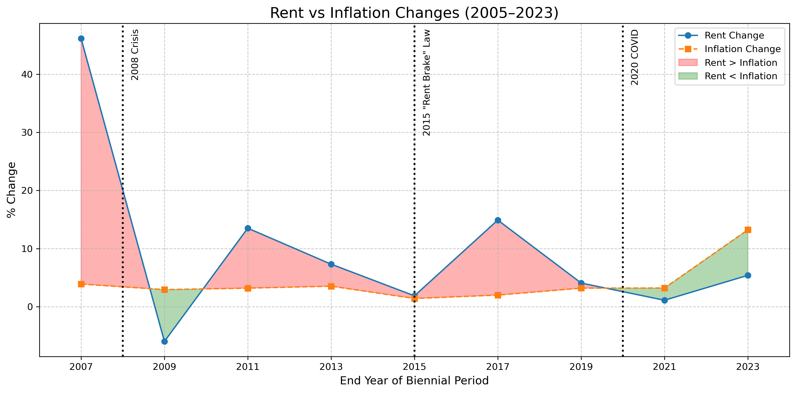

# 🏠📈 Berlin Rent Index vs. Inflation Analysis  

  

## 🔍 Project Overview  
This project statistically analyzes the relationship between Berlin's official rent index (Mietspiegel) and Germany's inflation rate from 2005-2023. The Mietspiegel surveys and reports **Kaltmiete** (base rent excluding utilities), serving as a legal benchmark for fair rents in Berlin.

*Hypothesis Test: Does rent change mirror inflation?*

## Hypothesis
- **H₀**: Biennial rent index change = Inflation rate (μ_rent = μ_inflation)

    *The biennial % change in Berlin's rent index = Germany's inflation rate*  
  (Mathematically: μ_rent = μ_inflation)

- **H₁**: Biennial rent index change ≠ Inflation rate (μ_rent ≠ μ_inflation)

    *The biennial % change in Berlin's rent index ≠ Germany's inflation rate*  
  (Mathematically: μ_rent ≠ μ_inflation)

**Core Question**:  
*"Do biennial changes in Berlin's base rent systematically differ from inflation changes?"*  

## 📋 Key Deliverables  
| File | Description |  
|------|-------------|  
| `analysis.ipynb` | Main analysis notebook |  
| `src/data_cleaning.py` | Data processing functions |  
| `data/processed/` | Cleaned datasets |  
| `visuals/` | Generated plots and charts |  

## 📊 Key Findings  

### 1. Long-Term Rent vs. Inflation Trend  
  
- **Observation**: Rent consistently increased while inflation showed volatility  
- **Divergence Peak**: 2021-2023 inflation spike vs. moderate rent growth  

### 2. Biennial Change Comparison  
#### Point Plot Version  
  
#### Bar Chart Version  
  
- **Key Insight**: Rent exceeded inflation in 7/9 periods  
- **Notable Divergence**: 2021-2023 (rent +5.4% vs inflation +13.2%)  

### 3. Statistical Power Analysis  
#### Single Dataset  
  
#### Expanded Dataset  
  
- **Critical Finding**:  
  - Current power (9 periods): 16.6%  
  - Required periods for 80% power: 59  

### 4. Rent-Inflation Change Over Time  
  
- **Pattern Identification**:  
  - Pre-2019: Higher rent volatility  
  - Post-2019: Stabilization despite economic shocks  

## 📈 Statistical Conclusions  

| Metric               | Value       | Interpretation          |  
|----------------------|-------------|-------------------------|  
| **p-value**          | 0.298       | > 0.05 → Fail to reject H₀ |  
| **Effect Size (d)**  | 0.37        | Small-medium effect     |  
| **Key Conclusion**   |             | No systematic difference |  

**Interpretation**:  
> "While we observe meaningful differences in specific periods (especially bevore 2019), statistical tests show no consistent evidence that rent changes systematically differ from inflation over the 2005-2023 period."  

## 🛠️ How to Reproduce  
### Step 1: Clone Repository  
```bash
git clone https://github.com/GFiaMon/data-wrangling-project.git
cd berlin-rent-inflation
```

### Step 2: Install Requirements  
```bash
pip install -r requirements.txt
```

### Step 3: Run Analysis  
Execute Jupyter notebook:  
```bash
jupyter notebook notebooks/01_mietspiegel_inflation_eda_full_dataset.ipynb
```

### Data Processing Workflow  


## 📂 Repository Structure  
```
berlin-rent-inflation/
├── data/
│   ├── raw/                   # Original datasets
│   └── processed/             # Cleaned data files
├── notebooks/
│   └── analysis.ipynb         # Main analysis notebook
├── src/
│   ├── data_cleaning.py       # Cleaning functions
├── visuals/                   # Generated plots
├── .gitignore
├── requirements.txt
└── README.md
```

## 📚 Data Sources  
1. **Mietspiegel Reports**  
   - [Berlin Senate Department](https://www.stadtentwicklung.berlin.de/)  
   - Years: 2005, 2007, 2009, 2011, 2013, 2015, 2017, 2019, 2021, 2023  
   
2. **Inflation Data**  
   - [World Bank Open Data](https://data.worldbank.org/indicator/FP.CPI.TOTL.ZG?end=2024&locations=DE&start=1960&view=chart&year=2024)

## 🔮 Future Research  
- District-level analysis  
- Integration of wage growth data  
- Predictive modeling of 2025 Mietspiegel  
- Impact assessment of rent control policies  

## 👥 Contact  
For questions or collaboration:
Guillermo
Fiallo Montero

[](https://www.linkedin.com/in/guillermo-fiallo-montero-734a87132/)

[](https://github.com/GFiaMon/data-wrangling-project)
